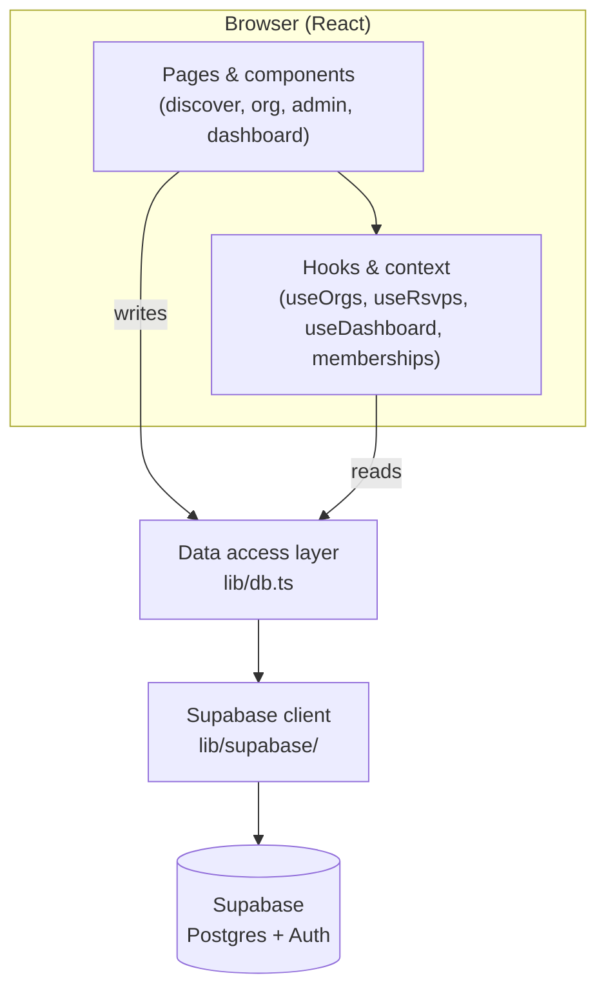
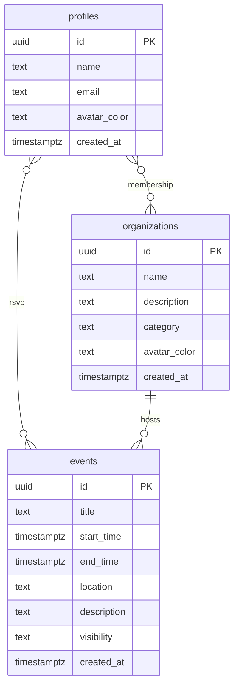
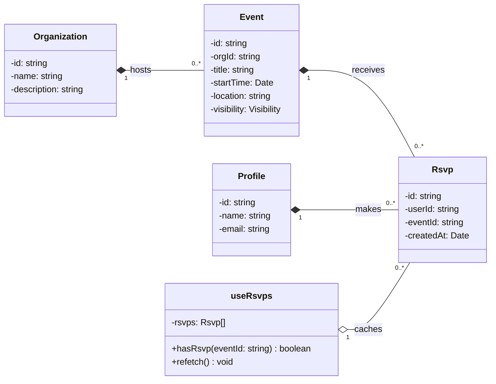

# ClubHub

ClubHub is a web application for UCLA student organizations. Students can browse and follow organizations, view their events, and RSVP. Organization admins can post events from an admin page.

## Tech Stack

- Next.js 16 / React 19 (TypeScript)
- Supabase (PostgreSQL database and authentication)
- Tailwind CSS
- Playwright (end-to-end testing)

## Prerequisites

- Node.js 20 or newer (required by Next.js 16 / React 19)
- A Supabase project (the free tier works) with its project URL and API keys

## Setup

Install dependencies:

```bash
npm install
```

Create a `.env.local` file in the project root with your Supabase credentials:

```
NEXT_PUBLIC_SUPABASE_URL=...
NEXT_PUBLIC_SUPABASE_ANON_KEY=...
SUPABASE_SERVICE_ROLE_KEY=...
```

Set up the database schema. In your Supabase project's SQL editor, run the migration files in `supabase/migrations/` in numerical order. They create the `profiles`, `organizations`, `memberships`, `events`, and `rsvps` tables along with the row-level security policies.

Seed the database with some sample organizations, events, and a test profile:

```bash
npm run seed
```

Start the development server:

```bash
npm run dev
```

The application runs at http://localhost:3000. Sign in with a UCLA email address, and a magic link will be sent to your inbox to finish signing in.

## Testing

End-to-end tests are written with Playwright and located in `test_suites/`.

```bash
npx playwright install
npm run test:e2e
```

Some tests require an authenticated session. Because Playwright cannot complete the email magic-link flow, these tests run as a fixed test user. Set these environment variables before running the tests. The test-user variable bypasses normal authentication and is meant for local testing only, so comment it out when you are done.

```
NEXT_PUBLIC_UNSAFE_E2E_USER_ID=b99e251d-0b9d-4fc0-aaf0-68d49c621df3
NEXT_PUBLIC_E2E_USER_EMAIL=clubhub-test@g.ucla.edu
NEXT_PUBLIC_E2E_ADMIN_ORG_ID=82a189ff-5d72-4a8e-8f50-baf71f4ac62a
NEXT_PUBLIC_E2E_FOLLOWER_ORG_ID=11111111-1111-4111-8111-111111111111
NEXT_PUBLIC_E2E_GUEST_ORG_ID=22222222-2222-4222-8222-222222222222
```

The test user is an admin of one organization, a follower of another, and a guest of a third, so tests can check what each role sees.

## Project Structure

- `app/` - pages and routing
- `components/` - reusable UI components
- `lib/` - data access layer (`lib/db.ts`), hooks, Supabase clients, and helpers
- `supabase/` - database schema and seed data
- `test_suites/` - Playwright tests

## System Architecture

This diagram shows how a request flows through the app. The React layer never talks to the database directly. It goes through the data access layer in `lib/db.ts`, which is the only part of the app that knows about Supabase. This keeps the UI decoupled from the backend (see the design decisions in our report for the reasoning).



The data access layer is the single seam between the frontend and the backend: components and hooks call plain functions like `followOrg(orgId)`, and those functions are the only code that builds Supabase queries.

## Data Model (Entity-Relationship Diagram)



`membership` (profiles-organizations, N-M) and `rsvp` (profiles-events, N-M) are junction tables; `hosts` (organizations-events) is 1-N.

## Domain Model (UML Class Diagram)



## Notes

- Row-level security is enabled on the database, so data access is enforced at the database layer.
