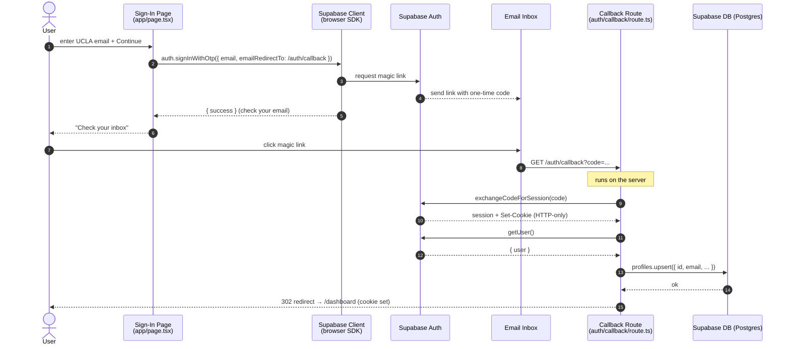
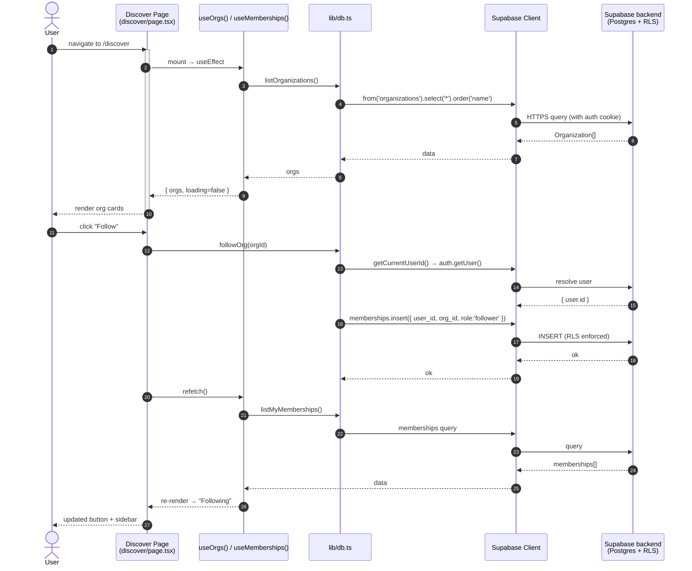
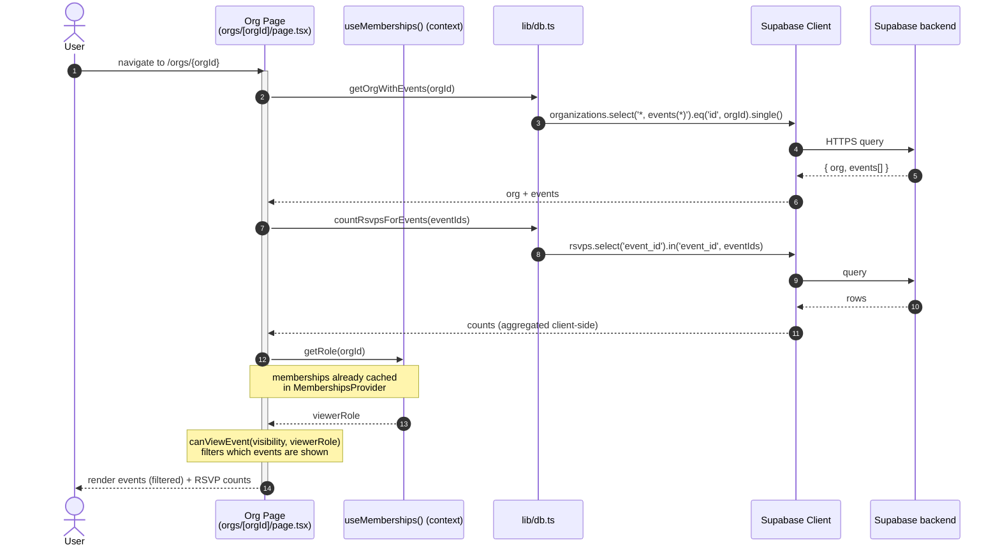
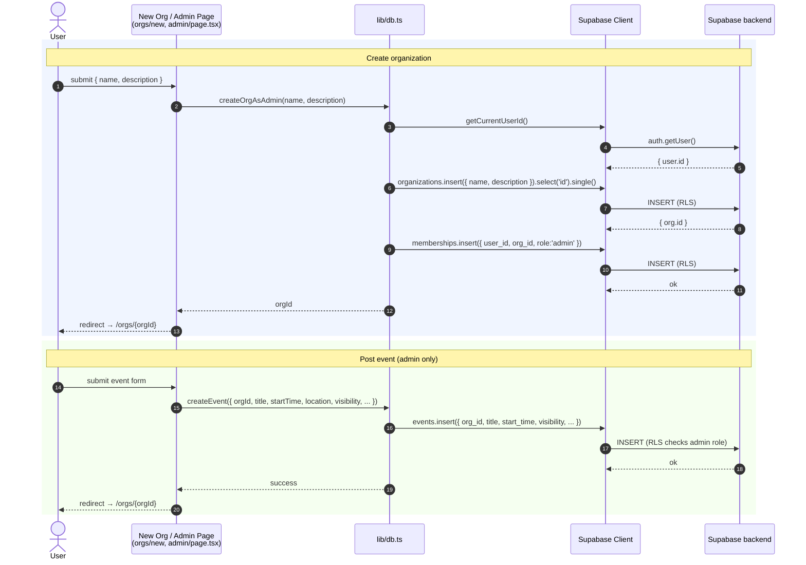
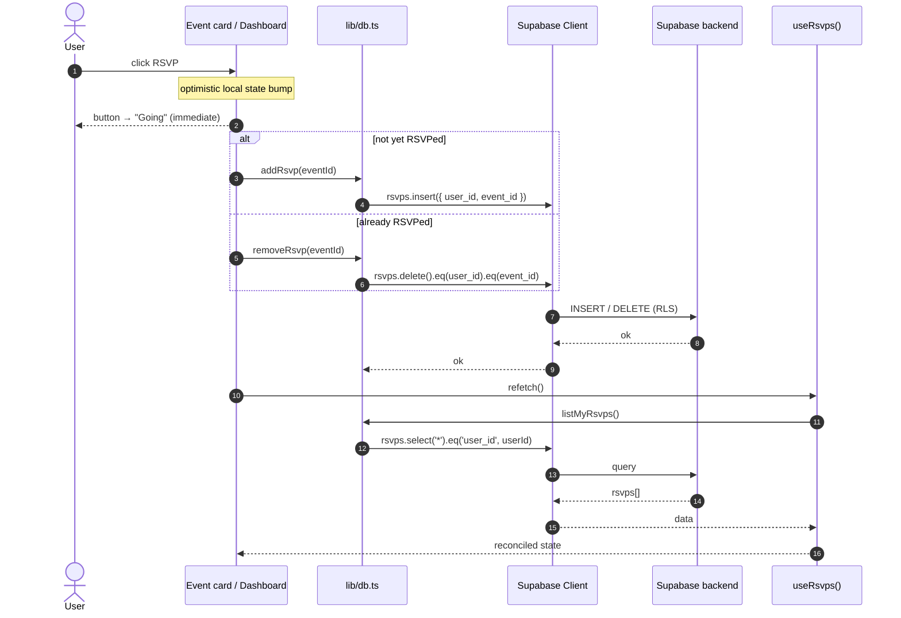

# ClubHub — Request Flow (UML Sequence Diagrams)

ClubHub is a **Next.js (App Router) client + Supabase backend-as-a-service** app.
Nearly all data access is **direct from the browser to Supabase** via the Supabase
JS client SDK — there is no custom API/server layer. The one server-side route is
the OAuth/magic-link callback (`app/auth/callback/route.ts`).

The layers shown below:

| Actor / Participant | What it is | Code |
|---|---|---|
| **User** | Person in the browser | — |
| **Page** (`'use client'`) | React page component | `app/(app)/**/page.tsx` |
| **Hook / Context** | Data-loading hooks & shared state | `lib/hooks/*`, `lib/context/memberships.tsx` |
| **db.ts** | Thin data-access wrappers | `lib/db.ts` |
| **Supabase client** | Browser SDK (`@supabase/ssr`) | `lib/supabase/client.ts` |
| **Supabase backend** | Postgres + Auth + Row-Level Security | hosted |
| **Callback route** | Server route handler | `app/auth/callback/route.ts` |

> Diagrams use [Mermaid](https://mermaid.js.org/), which renders natively on GitHub.

---

## 1. Authentication (magic link / OTP)

Auth tokens are stored in **HTTP-only cookies** managed by `@supabase/ssr`, so
every subsequent client query automatically carries the session.

---

## 2. Read flow — Discover page (list all orgs + follow)

---

## 3. Read flow — View org with events & RSVP counts

`MembershipsProvider` (`lib/context/memberships.tsx`) wraps `app/(app)/layout.tsx`
and loads the user's memberships **once**, so pages read roles from context
instead of re-querying.

---

## 4. Write flow — Create org / Post event (admin)

---

## 5. Write flow — RSVP toggle (optimistic update)

---

## Key architectural notes

- **No custom backend / API routes for data.** The browser talks to Supabase
  directly; authorization is enforced server-side by **Postgres Row-Level
  Security (RLS)** policies, not by an app server.
- **`lib/db.ts`** is the single data-access boundary — every query goes through it.
- **Hooks + context** (`useOrgs`, `useDashboard`, `useRsvps`, `MembershipsProvider`)
  own loading state and the `refetch()` pattern used after writes.
- **Auth** is the only server-side request path: the `/auth/callback` route
  exchanges the code for a session cookie and upserts the user's profile.
